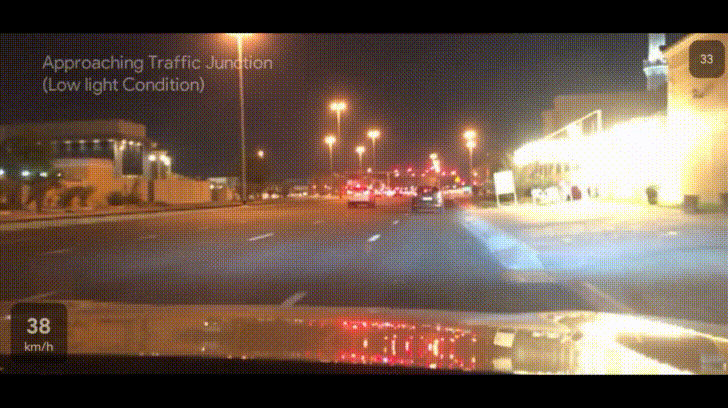

# 🚗DriveSafe🚗

---

## Introduction

***DriveSafe*** is a driver assistance system utilizing efficient mobile computer vision models in order to deliver enhanced safety to drivers. Features of this sytem include traffic light detection, stop sign detection, distance monitoring based on vheicle speed and pedestrian collision warning. Some of the features can be seen below.

  
  
  

## Build

Build information here

## Dataset

The fine-tuning stage requires correctly formatted `tfrecord` files. In order to create this from raw BDD100k images and labels please follow the instructions from `/Dataset` and copy the generated dataset to `/here/`

## Mobile application

## References